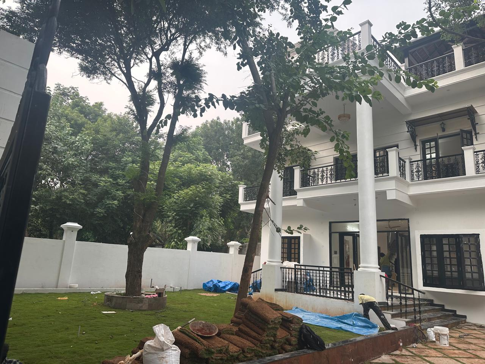
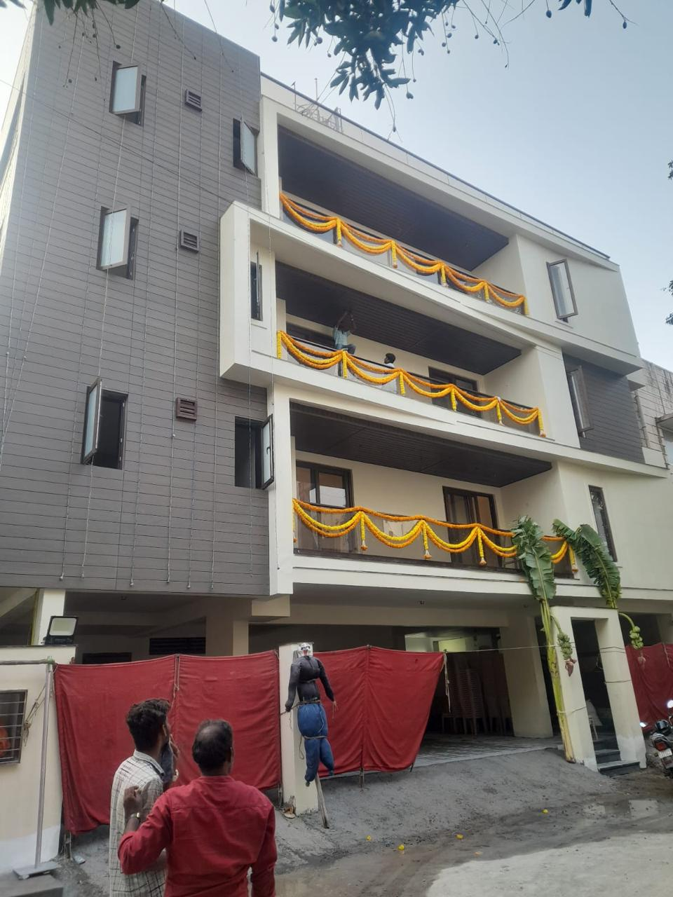
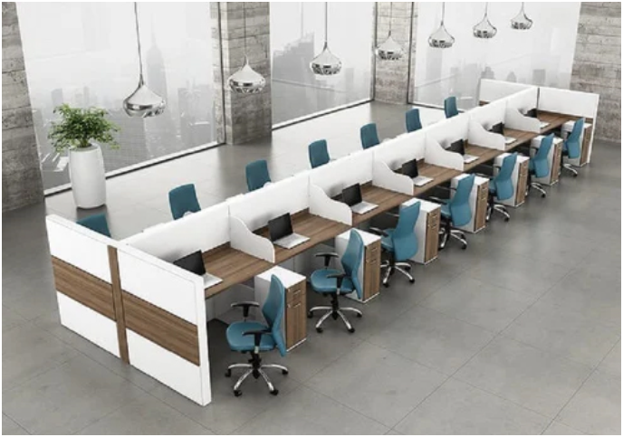
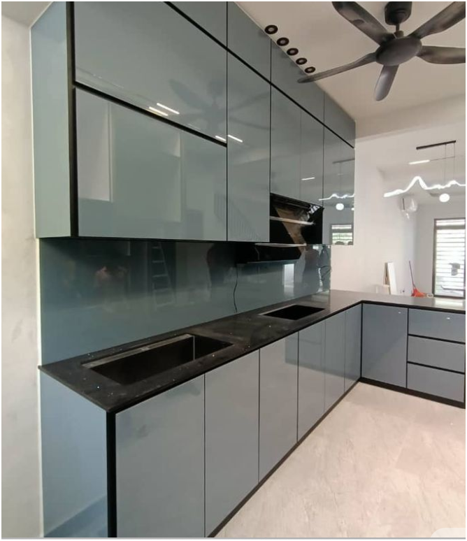
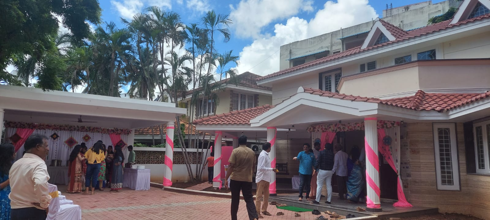
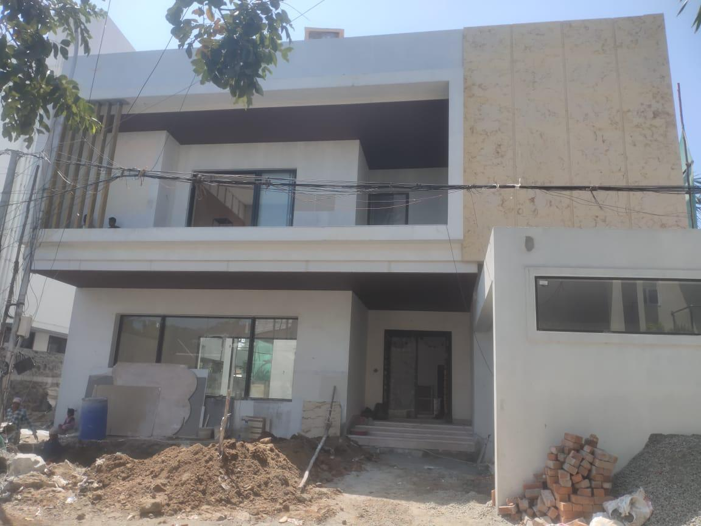
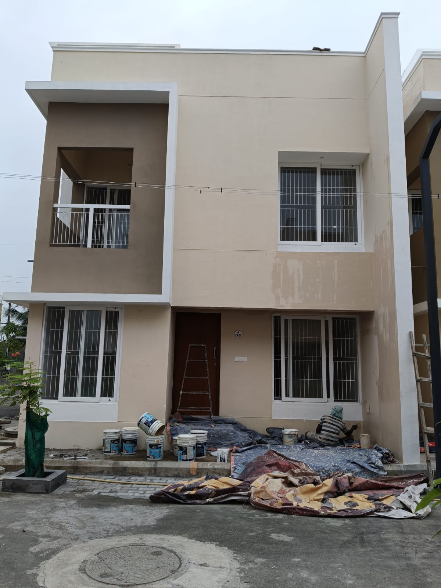
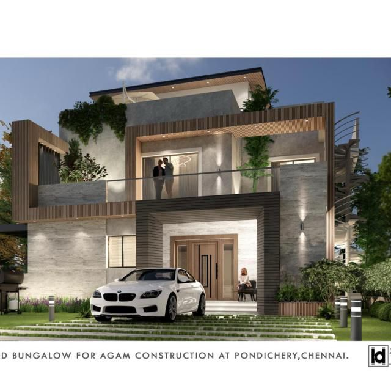

# Our Projects

  

    A selection of completed projects demonstrating our expertise across residential, commercial, and industrial construction.
  

---

  

    
    

      
🏡 Luxury Farmhouse

      
Nalla Farmhouse, Pondicherry

      

        

          
TYPE

          
Residential & Interior

        

        

          
DURATION

          
2 years

        

        

          
KEY WORKS

          
Full construction, custom interiors, HVAC & landscaping

        

      

    

  

  

    
    

      
🏢 3-Story Residential Building

      
Santhome, Chennai

      

        

          
TYPE

          
Residential & Interior

        

        

          
DURATION

          
11 months

        

        

          
SCALE

          
3 floors, full fit-out

        

        

          
KEY WORKS

          
Civil, plumbing, electrical, custom interiors, false ceilings

        

      

    

  

  

    
    

      
🏗️ Turnkey Office Interior

      
Visionary RCM Infotech, Tidel Park, Coimbatore

      

        

          
TYPE

          
Commercial Turnkey

        

        

          
DURATION

          
45 days

        

        

          
KEY WORKS

          
Full office fit-out, partitions, false ceiling, flooring, HVAC

        

      

    

  

  

    
    

      
🍳 Modular Kitchens

      
Rakindo Township, Coimbatore

      

        

          
TYPE

          
Modular Installation

        

        

          
DURATION

          
4 months

        

        

          
SCALE

          
120 units

        

        

          
KEY WORKS

          
Supply & installation of wooden modular kitchens with all fittings

        

      

    

  

---

## Other Completed Projects

  

    
    

      
Residential Building

      
Chennai

      
Residential

    

  

  

    
    

      
Residential Building

      
Chennai

      
Residential

    

  

  

    
    

      
Residential Building

      
Chennai

      
Residential

    

  

  

    
    

      
Residential Building

      
Pondicherry

      
Residential

    

  

---

  

    Successfully delivered projects across Chennai, Coimbatore, Pondicherry, and surrounding regions.
  

  

    

      📞 Discuss your project — 73730 78777 / 94444 47442
    

  

